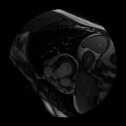
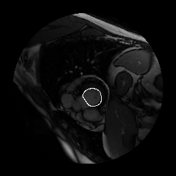

Introduction
------------

This project implements an MRI image data-processing pipeline which aims to
learn where the inner contour of the left ventricle of the heart is located
in an MRI image.

Pre-Requisites
--------------

* Python version 3 interpreter with pip
* virtualenv and virtualenvwrapper are recommended
* git (needed to clone source)

For instructions on installing python see:

https://www.python.org/downloads/

For instructions on installing virtualenvwrapper see:

http://virtualenvwrapper.readthedocs.io/en/latest/

Instructions for installing git can be found at:

https://git-scm.com/book/en/v2/Getting-Started-Installing-Git

Installation (for development)
------------------------------

The project can be setup using the following steps:

1. mkvirtualenv dicompipeline
2. git clone https://github.com/jfitzpatrick99/dicompipeline
3. cd dicompipeline
4. pip install -e .

Running
-------

To run the pipeline, execute the following command:

`dicompipeline --data-dir path/to/data`

Running Tests
-------------

To run the testsuite simply type `pytest` in the main project directory.

Code Layout
-----------

The top-level dicompipeline directory contains the source code for the
solution.
The top-level test directory contains tests for the solution.

Part 1: DICOM and Contour File Parsing
--------------------------------------

In order to verify that the dicom files and contour files are being parsed
correctly, the program can be invoked with a "--idir path/to/debug/dir"
argument which dumps both the original MRI scans and a modified file where the
contour line is drawn on top of the corresponding MRI scan. Example files are
shown below:

The only changes made to the originally supplied parsing code was to move the
slope and intercept rescaling code to the function that loads the dataset.

Part 2: Model Training Pipeline
-------------------------------

After building the data loading pipeline very little was changed to accomodate
the learning pipeline. The main changes were:

* Return two 1D arrays containing the images and the contour masks instead of
  one 2D array.
* Improve efficiency when loading datasets where pillow image objects are not
  created unless the "--idir" option is provided.

To verify that the model pipeline was working correctly I simply added logging
statements to ensure that what it was doing made sense, e.g. checked for number
of iterations, batch sizes were correct, etc. Of course as already mentioned
for part 1 of my solution I drew the contours on the images to make sure the
masks were correct.

Some deficiencies and/or possible improvements to my code given more time would
be:

* Improve error handling to make it more user friendly, e.g. when loading
  the dataset I would invent some application specific exceptions to trap cases
  where the dataset directory is not in the expected format.
* Depending on requirements there would be opporunities to trade memory for
  speed by storing the training data on the disk. Currently my solution loads
  the entire dataset into memory which would not work for an incredibly large
  dataset.
* I would definitely add more unit tests, and write additional integration
  tests.
* The load_dataset function is a little big so I would probably check to see if
  it could be shrunk down a bit, although I don't think this is a big deal.
* From a deployment perspective more testing would be needed to make sure that
  the setup.py file is correct so that the tool could be installed on the
  required platforms.
* I would also look at running the code through one of the many python linters
  that are available and cleaning up some of the imports.
* Tests that test the main entry point don't validate the output at all because
  I was not able to get the pytest capsys test fixture to work; I have always
  had problems with it and it would be a matter of figuring out what I did in
  the past to make it work here.
